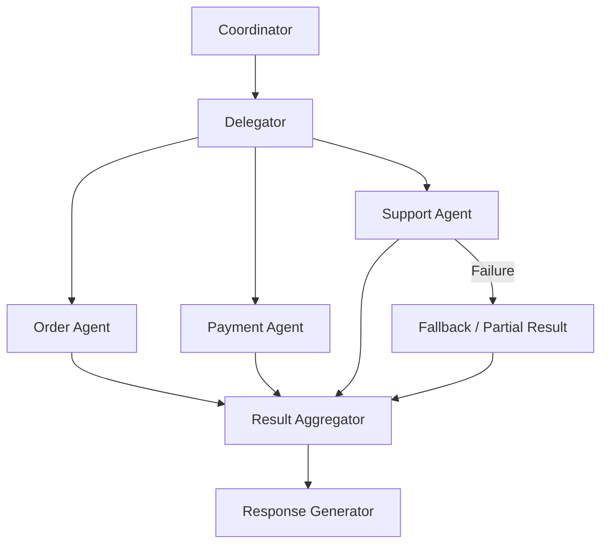
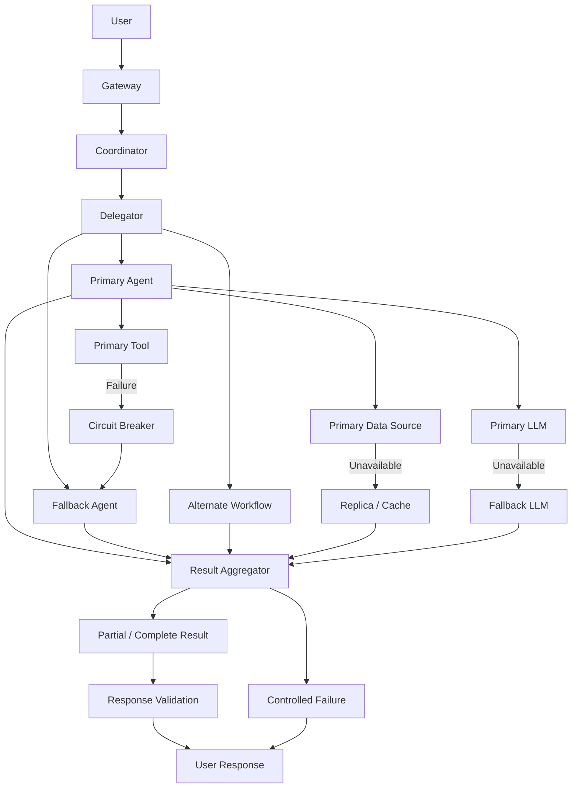

# Graceful Degradation and Partial Recovery in CWD

The goal is:

> **When one part of CWD is unavailable, the entire user request should not automatically fail. CWD should find the safest alternative path and return the most useful response it can, while clearly communicating what was unavailable or incomplete.**

This is called **graceful degradation**.

---

## 1. The problem

A CWD workflow can involve many dependencies:

```text
User
  │
  ▼
Gateway
  │
  ▼
Coordinator
  │
  ▼
Delegator
  │
  ├──────────────┐
  ▼              ▼
Agent A        Agent B
  │              │
  ▼              ▼
MCP Tool       Data Source
  │              │
  ▼              ▼
External API   Database
```

Any of these can fail.

For example:

```text
Agent A       → Available
Agent B       → Unavailable
CRM API       → Available
Knowledge DB  → Available
LLM Service   → Available
```

A poorly designed system responds:

```text
"Request failed."
```

A resilient CWD system asks:

> **What useful portion of the request can still be completed?**

---

# 2. Graceful degradation

Instead of:

```text
Dependency failure
       ↓
Entire workflow fails
```

CWD can use:

```text
Dependency failure
       ↓
Detect failure
       ↓
Classify failure
       ↓
Find alternate path
       ↓
Use fallback / partial result
       ↓
Return useful response
```

For example:

```text
Primary Agent unavailable
        │
        ▼
Try specialized fallback Agent
        │
        ▼
Unavailable
        │
        ▼
Use cached knowledge
        │
        ▼
Return partial answer
```

---

# 3. Four major resilience strategies

CWD can use four main strategies:

```text
                 Dependency Failure
                         │
          ┌──────────────┼──────────────┐
          ▼              ▼              ▼
       Fallback       Alternate       Partial
        Agent           Path           Result
          │              │              │
          └──────────────┼──────────────┘
                         ▼
                Controlled Failure
```

### 1. Fallback

Use another component that performs a similar function.

### 2. Alternate path

Change the workflow route.

### 3. Partial result

Return the successfully completed portions.

### 4. Controlled failure

If useful recovery is impossible, provide a safe and meaningful response rather than crashing.

---

# 4. Example: Customer Support Agent

Suppose the user asks:

> "Show me customer 123's order status, payment status, and recent support history."

CWD might orchestrate:

```text
Coordinator
    │
    ▼
Delegator
    │
    ├── Order Agent
    ├── Payment Agent
    └── Support Agent
```

Suppose:

```text
Order Agent     → Success
Payment Agent   → Success
Support Agent   → Failure
```

CWD should not necessarily return:

```text
"Unable to process request."
```

Instead:

```text
Order Status:
Delivered

Payment:
Paid

Support History:
Currently unavailable.
```

This is a **partial result**.

---

# 5. Partial results

Partial results are particularly important in multi-agent systems.

Suppose five workers are executing:

```text
Worker A → Customer profile       ✓
Worker B → Order history          ✓
Worker C → Payment history        ✓
Worker D → Recommendation engine  ✗
Worker E → Support history        ✓
```

CWD can aggregate:

```json
{
  "customer_profile": "available",
  "orders": "available",
  "payments": "available",
  "recommendations": "unavailable",
  "support_history": "available"
}
```

The final response could say:

```text
Customer profile: available
Orders: available
Payments: available
Support history: available

Recommendations could not be generated because the
recommendation service is temporarily unavailable.
```

The user still receives useful information.

---

# 6. Partial success in LangGraph-style orchestration

A workflow graph can model this explicitly.



The important concept is that:

> **Failure of one branch does not automatically terminate independent branches.**

---

# 7. Fallback agents

Suppose CWD normally uses:

```text
FinancialAnalysisAgent
```

but it becomes unavailable.

The Delegator can select:

```text
Primary:
FinancialAnalysisAgent

Fallback:
GeneralAnalysisAgent
```

Flow:

```text
Task
 │
 ▼
FinancialAnalysisAgent
 │
 X unavailable
 │
 ▼
GeneralAnalysisAgent
 │
 ▼
Result
```

However, the fallback must be capable of safely performing the reduced task.

Don't blindly substitute agents.

For example:

```text
MedicalDiagnosisAgent
        ↓
Failure
        ↓
GenericChatAgent
```

A generic agent should **not pretend to provide equivalent medical diagnosis**.

Instead:

```text
Specialized service unavailable.
I can provide general information, but I cannot
complete the specialized assessment right now.
```

This is controlled degradation.

---

# 8. Tool fallback

The same pattern applies to tools.

Suppose:

```text
Primary:
CRM API
```

fails.

CWD might use:

```text
CRM API
   ↓ unavailable
CRM Read Replica
   ↓ unavailable
Cached Customer Data
   ↓
Partial response
```

Example:

```text
CRM API
   │
   X
   │
   ▼
Read Replica
   │
   X
   │
   ▼
Cache
   │
   ▼
Response
```

But cached data must be labeled appropriately:

```text
Customer status:
Active

Data source:
Cached snapshot
Last updated:
10 minutes ago
```

This avoids presenting stale data as real-time truth.

---

# 9. Data-source fallback

Imagine CWD has:

```text
Primary Knowledge DB
        │
        X
        │
        ▼
Vector Database Replica
        │
        X
        │
        ▼
Document Cache
```

The system can progressively degrade:

```text
Best quality
     │
     ▼
Primary database
     │
     ▼
Replica
     │
     ▼
Cache
     │
     ▼
No source
     │
     ▼
Controlled failure
```

The response quality decreases, but availability improves.

---

# 10. LLM fallback

LLM availability is also important.

For example:

```text
Primary LLM
    │
    X timeout
    │
    ▼
Fallback LLM
    │
    ▼
Response
```

A production architecture might define:

```text
GPT model
   ↓ unavailable
Secondary GPT model
   ↓ unavailable
Smaller local model
   ↓ unavailable
Template-based response
```

The fallback hierarchy should be defined intentionally.

For example:

```python
LLM_PROVIDERS = [
    "primary-model",
    "secondary-model",
    "local-model"
]
```

Then:

```python
def generate_response(prompt):

    for provider in LLM_PROVIDERS:
        try:
            return provider.generate(prompt)

        except TimeoutError:
            continue

        except ServiceUnavailable:
            continue

    return controlled_failure_response()
```

In production, this should also include timeout budgets, circuit breakers, observability, and cost controls.

---

# 11. Alternate workflow paths

Sometimes the best fallback isn't another agent.

Instead, CWD can choose a different workflow.

For example:

```text
Normal workflow:

Request
   ↓
Real-time Analytics Agent
   ↓
Live Analytics API
   ↓
Detailed answer
```

If the analytics API is unavailable:

```text
Request
   ↓
Real-time Analytics Agent
   X
   ↓
Historical Analytics Agent
   ↓
Last available snapshot
   ↓
Approximate answer
```

This is an **alternate execution path**.

---

# 12. Conditional routing

This is where the Coordinator/Delegator becomes important.

Conceptually:

```python
if primary_available:
    route_to("PrimaryAgent")

elif fallback_available:
    route_to("FallbackAgent")

elif cached_data_available:
    route_to("CacheBasedAgent")

else:
    route_to("ControlledFailure")
```

The actual production implementation should usually make the availability decision using health state, circuit-breaker state, timeout history, and capability metadata rather than simply issuing sequential calls.

---

# 13. Failure classification

CWD should distinguish between failures.

```text
                    Failure
                       │
          ┌────────────┼────────────┐
          ▼            ▼            ▼
      Transient     Permanent    Dependency
          │            │            │
          ▼            ▼            ▼
        Retry        Fallback    Alternate path
                       │
                       ▼
                  Controlled result
```

Examples:

### Transient

```text
Timeout
HTTP 503
Temporary network error
Rate limit
```

→ Retry or fallback.

### Permanent

```text
Invalid input
Invalid schema
Unsupported operation
```

→ Controlled failure or alternative workflow.

### Dependency outage

```text
CRM unavailable
Database unavailable
LLM provider unavailable
```

→ Fallback/alternate path/partial result.

---

# 14. Failure budgets

A critical concept is that CWD should not endlessly try alternatives.

Imagine:

```text
Primary Agent timeout       5 sec
Fallback Agent timeout      5 sec
Cache lookup                2 sec
```

If the user's total request budget is:

```text
10 seconds
```

CWD cannot simply do:

```text
Primary → 20 sec
Fallback → 20 sec
Third fallback → 20 sec
```

The response becomes unusably slow.

Instead:

```text
Request budget = 10 sec

Primary       → 4 sec
Fallback      → 3 sec
Aggregation   → 1 sec
Response      → 2 sec
```

This is **deadline-aware degradation**.

---

# 15. Dependency health awareness

CWD can maintain health information:

```text
Dependency              Status
────────────────────────────────
Order Agent             HEALTHY
Payment Agent           HEALTHY
Support Agent            DEGRADED
CRM API                  DOWN
Knowledge DB             HEALTHY
LLM Provider A           DEGRADED
LLM Provider B           HEALTHY
```

The Delegator can then avoid unhealthy components.

Instead of:

```text
Task → Failed Agent → timeout
```

it can route directly:

```text
Task → Healthy fallback
```

This reduces latency and unnecessary failures.

---

# 16. Circuit breaker + fallback

These patterns work extremely well together.

```text
              Request
                 │
                 ▼
          Circuit Breaker
                 │
       ┌─────────┴─────────┐
       │                   │
     Closed                Open
       │                   │
       ▼                   ▼
 Primary Service       Fallback
       │                   │
       ▼                   ▼
    Result             Result
```

If the CRM API is repeatedly failing:

```text
CRM API
  ↓
Failures exceed threshold
  ↓
Circuit OPEN
  ↓
Don't call CRM
  ↓
Use cache / replica / fallback
```

This prevents CWD from repeatedly wasting time on an unhealthy dependency.

---

# 17. Fallback hierarchy

A mature CWD architecture can define a hierarchy:

```text
                  Primary
                     │
                 unavailable
                     │
                     ▼
                  Replica
                     │
                 unavailable
                     │
                     ▼
                   Cache
                     │
                 unavailable
                     │
                     ▼
              Partial Result
                     │
               impossible
                     │
                     ▼
          Controlled Failure
```

This gives the system predictable behavior.

---

# 18. Controlled failure response

Sometimes no safe fallback exists.

CWD should **not fabricate an answer**.

For example:

```text
User:
"Cancel order 123."
```

Order Management API is down.

Bad response:

```text
"Your order has been cancelled."
```

This is dangerous because CWD doesn't know whether the cancellation happened.

Better:

```text
"I couldn't complete the cancellation because the order
management service is currently unavailable. No cancellation
confirmation was received. Please retry when the service is
available."
```

This is a **controlled failure**.

---

# 19. Never confuse unavailable with successful

This is one of the most important production rules.

```text
Service unavailable
        ≠
Operation failed
        ≠
Operation succeeded
```

There may be an unknown state:

```text
Request sent
    ↓
Service processed request
    ↓
Response lost
    ↓
CWD timeout
```

CWD must not automatically retry a non-idempotent operation without determining whether it already happened.

For example:

```text
Payment
Order cancellation
Fund transfer
Account creation
```

may require reconciliation or idempotency.

---

# 20. Agent-to-agent graceful degradation

Suppose:

```text
Coordinator
    ↓
Delegator
    ↓
Research Agent
    ↓
Writer Agent
    ↓
Reviewer Agent
```

Reviewer Agent becomes unavailable.

CWD could still return:

```text
Research → Complete
Writing  → Complete
Review   → Unavailable
```

The final response could be:

```text
The report was generated successfully.

Note:
Automated review was unavailable, so the report was not
subjected to the normal reviewer-agent validation step.
```

This is much better than losing the entire report.

---

# 21. Dependency graph thinking

CWD should understand which dependencies are **critical** and which are **optional**.

For example:

```text
                    Request
                       │
                 Coordinator
                       │
              ┌────────┴────────┐
              ▼                 ▼
        Customer Data       Recommendations
          REQUIRED             OPTIONAL
              │                 │
              ▼                 ▼
            Result            Result
```

If recommendations fail:

```text
Customer Data ✓
Recommendations ✗
```

The request can succeed.

But if customer data fails:

```text
Customer Data ✗
```

the system may have to stop.

Therefore, every workflow should distinguish:

```text
Required dependency
Optional dependency
Degradable dependency
Non-degradable dependency
```

---

# 22. Critical vs optional tasks

A useful workflow definition might look like:

```python
tasks = [
    {
        "name": "customer_profile",
        "required": True
    },
    {
        "name": "recommendations",
        "required": False
    },
    {
        "name": "marketing_insights",
        "required": False
    }
]
```

The aggregator can then determine:

```python
if required_task_failed:
    return controlled_failure()

return partial_success()
```

---

# 23. Result aggregation

A production aggregator should preserve status.

For example:

```python
results = {
    "customer_profile": {
        "status": "success",
        "data": profile
    },

    "orders": {
        "status": "success",
        "data": orders
    },

    "recommendations": {
        "status": "unavailable",
        "reason": "Recommendation service timeout"
    }
}
```

Then:

```python
def aggregate(results):

    required_failures = [
        name
        for name, result in results.items()
        if result["status"] == "failed"
        and result.get("required", False)
    ]

    if required_failures:
        return {
            "status": "failed",
            "results": results
        }

    return {
        "status": "partial_success",
        "results": results
    }
```

The important part is that **failure information remains visible**.

---

# 24. User-facing response states

CWD can standardize response states:

```text
SUCCESS
PARTIAL_SUCCESS
DEGRADED
FAILED
UNKNOWN
```

For example:

### SUCCESS

```text
All requested information was retrieved successfully.
```

### PARTIAL_SUCCESS

```text
I retrieved the order and payment information, but
support history is temporarily unavailable.
```

### DEGRADED

```text
The live system is unavailable, so this response is based
on the latest cached information from 10 minutes ago.
```

### FAILED

```text
I couldn't safely complete this operation.
```

### UNKNOWN

```text
The request was submitted, but confirmation was not received.
Please do not retry until the operation status is verified.
```

---

# 25. CWD end-to-end architecture



---

# 26. Relationship with the other CWD reliability patterns

This capability builds on the reliability mechanisms you've been studying:

```text
                    CWD Reliability
                          │
       ┌──────────────────┼──────────────────┐
       ▼                  ▼                  ▼
    Timeout            Retry          Circuit Breaker
       │                  │                  │
       └──────────────────┼──────────────────┘
                          ▼
                       Failure
                          │
              ┌───────────┼───────────┐
              ▼           ▼           ▼
          Fallback      Partial     DLQ
           Path         Result
              │           │           │
              └───────────┼───────────┘
                          ▼
                     Recovery
                          │
              ┌───────────┼───────────┐
              ▼           ▼           ▼
           Replay      Checkpoint  Compensation
```

The distinction is:

* **Retry** → try the same operation again.
* **Fallback** → use another capable component.
* **Alternate path** → execute a different workflow.
* **Partial result** → return successful portions.
* **Circuit breaker** → stop repeatedly calling an unhealthy dependency.
* **DLQ** → isolate work that cannot currently be processed.
* **Checkpoint** → preserve where the workflow can resume.
* **Compensation** → correct side effects when necessary.

---

# 27. Production example

Consider an enterprise report request:

> "Generate a customer health report using CRM data, support tickets, product usage, and recommendations."

CWD creates:

```text
Coordinator
     │
     ▼
Delegator
     │
     ├── CRM Agent ────────── ✓
     ├── Support Agent ────── ✓
     ├── Usage Agent ──────── ✓
     └── Recommendation Agent ✗
```

Instead of failing everything:

```text
Customer information     ✓
Support information      ✓
Product usage            ✓
Recommendations          ✗
```

CWD produces:

```text
Customer Health Report

Customer profile:
Available

Support activity:
Available

Product usage:
Available

Recommendations:
Temporarily unavailable because the recommendation
service is experiencing an outage.

Overall report:
PARTIAL
```

This is useful **and honest**.

---

# 28. The most important design principle

Graceful degradation must not become **silent degradation**.

Bad:

```text
Recommendation service failed
       ↓
CWD says nothing
       ↓
User assumes recommendations were included
```

Good:

```text
Recommendation service failed
       ↓
CWD records failure
       ↓
CWD returns available results
       ↓
CWD explicitly identifies missing information
```

So the rule is:

> **Degrade functionality, not truthfulness.**

---

# 29. Interview-ready explanation

> **“CWD is designed so that the failure of an individual agent, tool, data source, or downstream service does not automatically cause the entire workflow to fail. The Coordinator and Delegator use health information, timeouts, circuit breakers, fallback agents, alternate workflow paths, and cached or replicated data to find the safest available execution path. For multi-agent workflows, independent tasks can continue even if one branch fails, and the Result Aggregator can return partial results with explicit availability status. When no safe fallback exists, CWD uses a controlled failure response rather than fabricating a result. For operations that may have an unknown outcome, such as payments or cancellations, CWD uses idempotency, reconciliation, checkpoints, and controlled recovery rather than blindly retrying. This provides high availability while maintaining correctness and transparency.”**

### Mental model

```text
Dependency fails
      ↓
Can I retry safely?
      ↓
Can I use a fallback?
      ↓
Can I use an alternate path?
      ↓
Can I return a partial result?
      ↓
If not → controlled failure
      ↓
Never fabricate success
```

**Core principle:**

> **CWD should maximize useful work, minimize blast radius, and preserve correctness when dependencies fail.**
