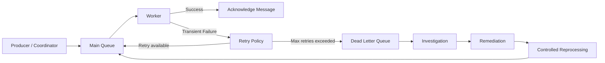
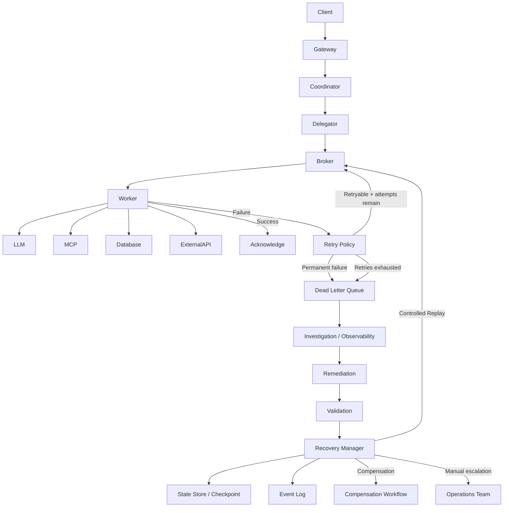

# Dead Letter Queues (DLQ) in CWD

A **Dead Letter Queue (DLQ)** is a safety mechanism in CWD that isolates messages that **cannot be successfully processed after repeated attempts**, preventing those messages from continuously blocking or destabilizing the main processing pipeline.

The key idea is:

> **Retry transient failures, but move persistently failing messages to a DLQ so the healthy workload can continue.**

---

## 1. Why CWD needs a DLQ

Consider this CWD flow:

```text
Client
  │
  ▼
Gateway
  │
  ▼
Coordinator
  │
  ▼
Message Broker
  │
  ▼
Worker
  │
  ▼
MCP Tool / API / Database
```

Suppose a Worker receives:

```json
{
  "task_id": "T-10045",
  "type": "customer_analysis",
  "customer_id": "C12345"
}
```

The Worker tries to process it.

```text
Attempt 1 → Database timeout
Attempt 2 → Database timeout
Attempt 3 → Database timeout
Attempt 4 → Database timeout
```

Without a DLQ, the system might keep doing:

```text
Message
   ↓
Worker
   ↓
Failure
   ↓
Retry
   ↓
Worker
   ↓
Failure
   ↓
Retry
   ↓
∞
```

This creates a **poison message**.

A poison message is a message that repeatedly fails because of something such as:

* malformed payload
* invalid task parameters
* unsupported operation
* corrupted data
* permanent authorization failure
* incompatible schema
* missing required resource
* deterministic application bug

The DLQ breaks this cycle.

---

# 2. Basic DLQ architecture



The normal path remains healthy:

```text
Main Queue → Worker → Success
```

while problematic messages are separated:

```text
Main Queue → Worker → Failure
                    ↓
              Retry attempts
                    ↓
                   DLQ
```

---

# 3. DLQ is not simply a failed queue

A DLQ should contain enough information to answer:

> **What failed, why did it fail, what happened before the failure, and can we safely process it again?**

A useful DLQ message might look like:

```json
{
  "message_id": "MSG-78901",
  "task_id": "TASK-10045",
  "workflow_id": "WF-5001",

  "original_queue": "worker.tasks",
  "worker_type": "CustomerAnalysisWorker",

  "payload": {
    "customer_id": "C12345",
    "operation": "risk_analysis"
  },

  "failure": {
    "error_type": "DatabaseTimeout",
    "error_message": "Connection timeout",
    "failed_at": "2026-09-07T18:30:21Z"
  },

  "retry": {
    "attempt_count": 5,
    "max_attempts": 5,
    "first_attempt": "2026-09-07T18:25:01Z",
    "last_attempt": "2026-09-07T18:30:21Z"
  },

  "trace": {
    "correlation_id": "CORR-12345",
    "trace_id": "TRACE-99881"
  },

  "created_at": "2026-09-07T18:30:21Z"
}
```

This makes the DLQ an **operational investigation point**, not merely a storage bucket.

---

# 4. Message lifecycle

A typical CWD message lifecycle is:

```text
                 ┌───────────────┐
                 │   Main Queue  │
                 └───────┬───────┘
                         │
                         ▼
                 ┌───────────────┐
                 │     Worker    │
                 └───────┬───────┘
                         │
                 ┌───────┴────────┐
                 │                │
              Success           Failure
                 │                │
                 ▼                ▼
              ACK          Is failure retryable?
                                  │
                        ┌─────────┴─────────┐
                        │                   │
                       Yes                  No
                        │                   │
                        ▼                   ▼
                    Retry             DLQ immediately
                        │
                        ▼
                  Retry attempts
                        │
                ┌───────┴────────┐
                │                │
             Success          Exhausted
                │                │
                ▼                ▼
               ACK               DLQ
```

---

# 5. Retry + DLQ

The DLQ normally works together with a retry policy.

For example:

```text
Maximum attempts = 5
```

A message could go through:

```text
Attempt 1
   ↓
Failure
   ↓
Wait 1 sec

Attempt 2
   ↓
Failure
   ↓
Wait 2 sec

Attempt 3
   ↓
Failure
   ↓
Wait 4 sec

Attempt 4
   ↓
Failure
   ↓
Wait 8 sec

Attempt 5
   ↓
Failure
   ↓
DLQ
```

This is particularly useful for transient failures.

For example:

```text
Worker → API
         │
         └── HTTP 503
```

The API might recover a few seconds later.

But if the same message fails five times because:

```text
customer_id = null
```

retrying it indefinitely is useless.

Move it to the DLQ.

---

# 6. Transient vs permanent failures

This distinction is critical.

### Transient failure

Likely to succeed later.

Examples:

```text
HTTP 503
Database timeout
Network timeout
Temporary service unavailable
Rate limit
Broker connection failure
```

Action:

```text
Retry
```

---

### Permanent failure

Likely to fail again with the same input.

Examples:

```text
Invalid JSON
Missing required field
Invalid customer ID
Unsupported operation
Schema validation failure
Permission denied
Business rule violation
```

Action:

```text
DLQ
```

You don't necessarily need to consume all retry attempts for a clearly permanent error.

---

# 7. DLQ in CWD

For the CWD architecture, think of the flow as:

```text
                    CWD
                     │
              ┌──────▼──────┐
              │ Coordinator  │
              └──────┬──────┘
                     │
              ┌──────▼──────┐
              │  Delegator   │
              └──────┬──────┘
                     │
                     ▼
              ┌─────────────┐
              │ Message Bus  │
              └──────┬──────┘
                     │
        ┌────────────┼─────────────┐
        ▼            ▼             ▼
     Worker A     Worker B      Worker C
        │            │             │
        ▼            ▼             ▼
      Tools        APIs          LLM
        │            │             │
        └────────────┴─────────────┘
                     │
                  failures
                     │
                     ▼
                Retry Policy
                     │
              max retries?
                     │
                     ▼
                   DLQ
```

The important principle is:

> **A failed Worker should not be allowed to repeatedly poison the main queue.**

---

# 8. What happens after a message enters the DLQ?

Putting a message in the DLQ is **not the end of the recovery process**.

It starts an operational workflow:

```text
DLQ
 │
 ▼
Detect
 │
 ▼
Investigate
 │
 ▼
Classify
 │
 ├── Bad payload
 │
 ├── Application bug
 │
 ├── External dependency failure
 │
 ├── Configuration problem
 │
 └── Security / authorization problem
 │
 ▼
Remediate
 │
 ▼
Validate
 │
 ▼
Controlled Reprocessing
 │
 ▼
Main Queue
```

---

# 9. Investigation

Operations teams need visibility into DLQ messages.

A DLQ dashboard could show:

| Field         | Example                |
| ------------- | ---------------------- |
| Message ID    | MSG-78901              |
| Workflow      | WF-5001                |
| Task          | TASK-10045             |
| Worker        | CustomerAnalysisWorker |
| Error         | DatabaseTimeout        |
| Attempts      | 5                      |
| First failure | 18:25                  |
| Last failure  | 18:30                  |
| Status        | DLQ                    |
| Trace ID      | TRACE-99881            |
| Priority      | High                   |

This allows an engineer to identify patterns.

For example:

```text
DLQ messages

CustomerAnalysisWorker     842
InvoiceWorker                12
EmailWorker                   3
```

That immediately suggests:

> Something is wrong with CustomerAnalysisWorker or one of its dependencies.

---

# 10. Correlation ID and trace ID

DLQ messages should preserve observability information.

For example:

```text
correlation_id = CORR-12345
workflow_id    = WF-5001
task_id        = TASK-10045
trace_id       = TRACE-99881
```

Then an engineer can trace:

```text
User Request
     │
     ▼
Gateway
     │
     ▼
Coordinator
     │
     ▼
Delegator
     │
     ▼
Worker
     │
     ▼
MCP Tool
     │
     ▼
Database
     │
     X
  Timeout
     │
     ▼
Retry
     │
     ▼
DLQ
```

This connects **messaging + observability + workflow state**.

---

# 11. Controlled reprocessing

One of the most important DLQ capabilities is **controlled replay**.

Do not simply dump the entire DLQ back into production.

Instead:

```text
DLQ
 │
 ▼
Select message
 │
 ▼
Investigate
 │
 ▼
Fix underlying problem
 │
 ▼
Validate message
 │
 ▼
Replay
 │
 ▼
Main Queue
```

For example:

```text
DLQ contains 10,000 messages

       ↓

Only 20 belong to the fixed bug

       ↓

Select those 20

       ↓

Replay 5

       ↓

Validate

       ↓

Replay remaining 15
```

This prevents another production incident.

---

# 12. Reprocessing should be idempotent

Suppose a Worker processes:

```text
TASK-10045
```

and creates:

```text
Payment = $500
```

The Worker crashes after the payment succeeds but before the message is acknowledged.

The broker may redeliver the message.

Without idempotency:

```text
Message
   ↓
Payment $500
   ↓
Crash
   ↓
Retry
   ↓
Payment $500 AGAIN
```

Now you've created a duplicate side effect.

Instead, use an idempotency key:

```python
idempotency_key = "TASK-10045"
```

Before performing the operation:

```python
if already_processed(idempotency_key):
    return "Already processed"

result = perform_operation()

record_processed(idempotency_key)

return result
```

Therefore:

```text
Replay
  ↓
Same task ID
  ↓
Idempotency check
  ↓
Already completed?
  ├── Yes → Don't repeat side effect
  └── No  → Execute
```

This is essential for safe DLQ reprocessing.

---

# 13. DLQ and LangGraph/CWD workflow state

Because CWD uses workflow state and checkpoints, DLQ recovery should not depend only on the message payload.

A DLQ entry can point back to:

```text
workflow_id
task_id
checkpoint_id
message_id
trace_id
```

For example:

```json
{
  "workflow_id": "WF-5001",
  "task_id": "TASK-10045",
  "checkpoint_id": "CP-450",
  "message_id": "MSG-78901"
}
```

Then recovery can determine:

```text
Where was the workflow?
        ↓
Which task failed?
        ↓
What state existed before failure?
        ↓
Was the task partially completed?
        ↓
Can we resume from checkpoint?
        ↓
Should we retry or compensate?
```

This makes DLQ recovery much safer.

---

# 14. DLQ + checkpoint recovery

Consider:

```text
Coordinator
     │
     ▼
Checkpoint CP1
     │
     ▼
Delegator
     │
     ▼
Worker A ─────── Success
     │
     ▼
Checkpoint CP2
     │
     ▼
Worker B ─────── Failure
     │
     ▼
Retry × 5
     │
     ▼
DLQ
```

After the underlying issue is fixed:

```text
DLQ
 │
 ▼
Recovery Manager
 │
 ▼
Load CP2
 │
 ▼
Restore workflow state
 │
 ▼
Re-submit Worker B task
 │
 ▼
Continue workflow
```

The system doesn't necessarily have to restart the entire workflow from the beginning.

---

# 15. DLQ and poison messages

A **poison message** is one of the primary reasons DLQs exist.

Example:

```json
{
    "task": "customer_analysis",
    "customer_id": null
}
```

Worker:

```python
def process(message):
    customer_id = message["customer_id"]

    if customer_id is None:
        raise ValueError("customer_id is required")
```

Retrying this message 100 times doesn't help.

Instead:

```text
Validation Failure
       ↓
Permanent Error
       ↓
DLQ
```

The rest of the queue continues:

```text
Message A → Success
Message B → Success
Message C → DLQ
Message D → Success
Message E → Success
```

That's **failure isolation**.

---

# 16. DLQ should not become a second production queue

A common mistake is:

```text
Main Queue
     ↓
Failure
     ↓
DLQ
     ↓
Automatically retry forever
     ↓
Main Queue
     ↓
DLQ
     ↓
...
```

That's just an infinite failure loop.

Instead, DLQ processing should be controlled:

```text
DLQ
 │
 ├── Investigate
 │
 ├── Fix
 │
 ├── Validate
 │
 ├── Replay
 │
 └── Escalate
```

Reprocessing should require appropriate operational controls.

---

# 17. DLQ states

A useful operational model is:

```text
                ┌───────────┐
                │    DLQ    │
                └─────┬─────┘
                      │
                      ▼
                ┌───────────┐
                │   NEW     │
                └─────┬─────┘
                      │
                      ▼
              ┌───────────────┐
              │ INVESTIGATING │
              └───────┬───────┘
                      │
             ┌────────┼─────────┐
             ▼        ▼         ▼
          FIXED     INVALID   UNKNOWN
             │        │         │
             ▼        ▼         ▼
          REPLAY    DISCARD   ESCALATE
             │
             ▼
           SUCCESS
```

This gives operations teams a clear lifecycle.

---

# 18. DLQ security considerations

DLQ messages can contain sensitive enterprise information.

Therefore, CWD should consider:

```text
Encryption at rest
Encryption in transit
RBAC
Access auditing
Data masking
Retention policies
Message expiration
PII protection
Secure replay authorization
```

Not every operator should have permission to replay every message.

For example:

```text
Operator
   │
   ├── View DLQ
   │
   └── Investigate

Senior Operator
   │
   ├── Retry
   └── Replay

Administrator
   │
   └── Purge
```

---

# 19. DLQ monitoring

CWD dashboards should monitor:

### DLQ depth

```text
dlq_messages = 842
```

### DLQ growth rate

```text
+120 messages / minute
```

### Oldest message age

```text
oldest_message_age = 47 minutes
```

### Failure reason

```text
DatabaseTimeout       520
SchemaValidation      200
Authorization          80
Unknown                42
```

### Worker distribution

```text
Worker-A    20
Worker-B   780
Worker-C    42
```

These metrics can trigger alerts.

Example:

```text
IF dlq_depth > 100
    → Warning

IF dlq_depth > 1000
    → Critical

IF dlq_growth_rate > threshold
    → Incident
```

---

# 20. DLQ alerting

A production alert might say:

```text
🚨 CWD DLQ Alert

Queue: customer-analysis
DLQ depth: 1,284
Growth: +185/min
Oldest message: 22 minutes
Primary error: DatabaseTimeout
Affected worker: CustomerAnalysisWorker
```

This is much more actionable than:

```text
Worker failed.
```

---

# 21. Example implementation

A simplified Python consumer:

```python
MAX_RETRIES = 5


def process_message(message):

    try:
        result = worker.execute(message)

        acknowledge(message)

        return result

    except TransientError as exc:

        if message.retry_count < MAX_RETRIES:

            retry(message)

        else:

            move_to_dlq(
                message=message,
                reason=str(exc),
                error_type="TransientError"
            )

    except PermanentError as exc:

        move_to_dlq(
            message=message,
            reason=str(exc),
            error_type="PermanentError"
        )
```

The important distinction is:

```text
Transient
   ↓
Retry
   ↓
Eventually DLQ if exhausted

Permanent
   ↓
DLQ immediately
```

---

# 22. A more production-oriented design

```python
def handle_message(message):

    try:
        validate_message(message)

        result = execute_task(message)

        mark_success(message)

        acknowledge(message)

    except RetryableError as exc:

        if attempts_exhausted(message):

            send_to_dlq(
                message,
                failure=exc,
                classification="RETRY_EXHAUSTED"
            )

        else:

            schedule_retry(message)

    except NonRetryableError as exc:

        send_to_dlq(
            message,
            failure=exc,
            classification="NON_RETRYABLE"
        )

    except Exception as exc:

        send_to_dlq(
            message,
            failure=exc,
            classification="UNKNOWN"
        )
```

In a real CWD implementation, the broker, state store, event log, observability system, and recovery manager would provide the surrounding infrastructure.

---

# 23. DLQ + recovery architecture

The complete pattern looks like:



This connects DLQ with the broader CWD reliability architecture.

---

# 24. DLQ vs Retry vs Circuit Breaker

These mechanisms solve different problems.

| Mechanism           | Purpose                                           |
| ------------------- | ------------------------------------------------- |
| **Retry**           | Recover from transient failure                    |
| **DLQ**             | Isolate messages that repeatedly/permanently fail |
| **Circuit Breaker** | Stop calling an unhealthy dependency              |
| **Timeout**         | Prevent operations from hanging indefinitely      |
| **Checkpoint**      | Preserve workflow recovery state                  |
| **Replay**          | Reprocess/reconstruct after recovery              |
| **Compensation**    | Correct already-completed side effects            |

A useful mental model:

```text
Timeout
   ↓
Retry
   ↓
Circuit Breaker protects dependency
   ↓
Retries exhausted
   ↓
DLQ
   ↓
Investigation
   ↓
Remediation
   ↓
Controlled Replay
   ↓
Checkpoint / Workflow Recovery
```

---

# 25. Important production considerations

For CWD, a robust DLQ design should include:

### 1. Maximum retry count

Prevent infinite retries.

### 2. Backoff + jitter

Prevent retry storms.

### 3. Failure classification

Separate:

```text
Transient
Permanent
Unknown
```

### 4. Original message preservation

Never lose the original payload/context.

### 5. Failure metadata

Store:

```text
error
stack trace
attempt count
timestamp
worker
workflow
task
trace ID
```

### 6. Idempotent replay

Prevent duplicate side effects.

### 7. Controlled reprocessing

Don't automatically flood production with DLQ messages.

### 8. Checkpoint integration

Resume workflows from known safe state.

### 9. Observability

Monitor:

```text
DLQ depth
DLQ age
failure reason
failure rate
worker distribution
reprocessing success rate
```

### 10. Auditability

Record:

```text
Who inspected?
Who approved replay?
When was it replayed?
What happened?
Was compensation required?
```

---

# 26. End-to-end example

Imagine CWD receives:

```text
"Analyze customer C123 and generate a risk report."
```

The flow is:

```text
User
 ↓
Gateway
 ↓
Coordinator
 ↓
Delegator
 ↓
RiskAnalysisWorker
 ↓
MCP Customer Database
```

The MCP database service begins returning:

```text
HTTP 503
```

Worker behavior:

```text
Attempt 1 → 503
Attempt 2 → 503
Attempt 3 → 503
Attempt 4 → 503
Attempt 5 → 503
```

The message moves to:

```text
RiskAnalysisWorker.DLQ
```

CWD records:

```text
workflow_id = WF-100
task_id     = TASK-200
worker      = RiskAnalysisWorker
error       = HTTP 503
attempts    = 5
checkpoint  = CP-50
trace_id    = TRACE-900
```

Operations sees:

```text
DLQ depth ↑
```

and discovers:

```text
Customer Database
      ↓
Service outage
```

The database service is restored.

The team then:

```text
1. Validate dependency
2. Validate original task
3. Select DLQ message
4. Approve replay
5. Restore checkpoint CP-50
6. Re-submit task
7. Worker executes
8. Result generated
9. Workflow continues
10. DLQ item marked recovered
```

No new customer request is required.

---

# 27. The key architectural principle

The most important idea is:

> **A DLQ converts uncontrolled repeated failure into controlled operational recovery.**

Without DLQ:

```text
Failure → Retry → Failure → Retry → Failure → System instability
```

With DLQ:

```text
Failure
   ↓
Retry
   ↓
Retry exhausted
   ↓
DLQ
   ↓
Healthy workload continues
   ↓
Investigation
   ↓
Remediation
   ↓
Controlled replay
   ↓
Recovery
```

---

## Interview-ready explanation

> **“In CWD, the Dead Letter Queue provides failure isolation for messages that cannot be successfully processed. Transient failures are retried using bounded retries with backoff, while permanent failures or messages that exhaust their retry policy are moved to the DLQ. The DLQ preserves the original message, workflow/task identifiers, error information, retry history, checkpoint, and tracing metadata so operations teams can investigate the failure. After remediation, messages can be selectively and safely reprocessed rather than replaying the entire queue. Reprocessing is protected by idempotency and workflow checkpoints to prevent duplicate side effects and allow the workflow to resume from a known state. This makes the DLQ an important part of CWD's production reliability, observability, and operational recovery strategy.”**

### Mental model

```text
Retry       = "Try again."
Timeout     = "Don't wait forever."
Circuit     = "Stop hitting an unhealthy dependency."
DLQ         = "Remove the bad message from the healthy flow."
Checkpoint  = "Remember where the workflow was."
Replay      = "Try the failed work again after fixing the problem."
Compensation= "Correct side effects that already happened."
```

**Central rule:**

> **Keep the main queue healthy, preserve the failed work, investigate safely, and reprocess only when the system is ready.**
